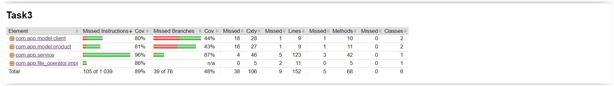

# Shopping program

The program is used to manage customer purchases based on data stored in text files. It consists of three main classes: Customer, Product and Purchases, which work together to analyze and report purchasing information. Analyzes customer purchase data, calculates statistics and reports on customer spending, purchasing preferences by age, average product prices and customers' ability to pay for purchases. These results are presented in the form of maps, which facilitates their interpretation and further analysis.

## Technologies and libraries used

* Java
* Maven
* Lombok
* JUnit
* AssertJ

## Jacoco Coverage

## Required files

* Purchases file with pattern ( csv ):

  clientId;name;surname;age;money[productId;name;category;price productId;name;category;price]

